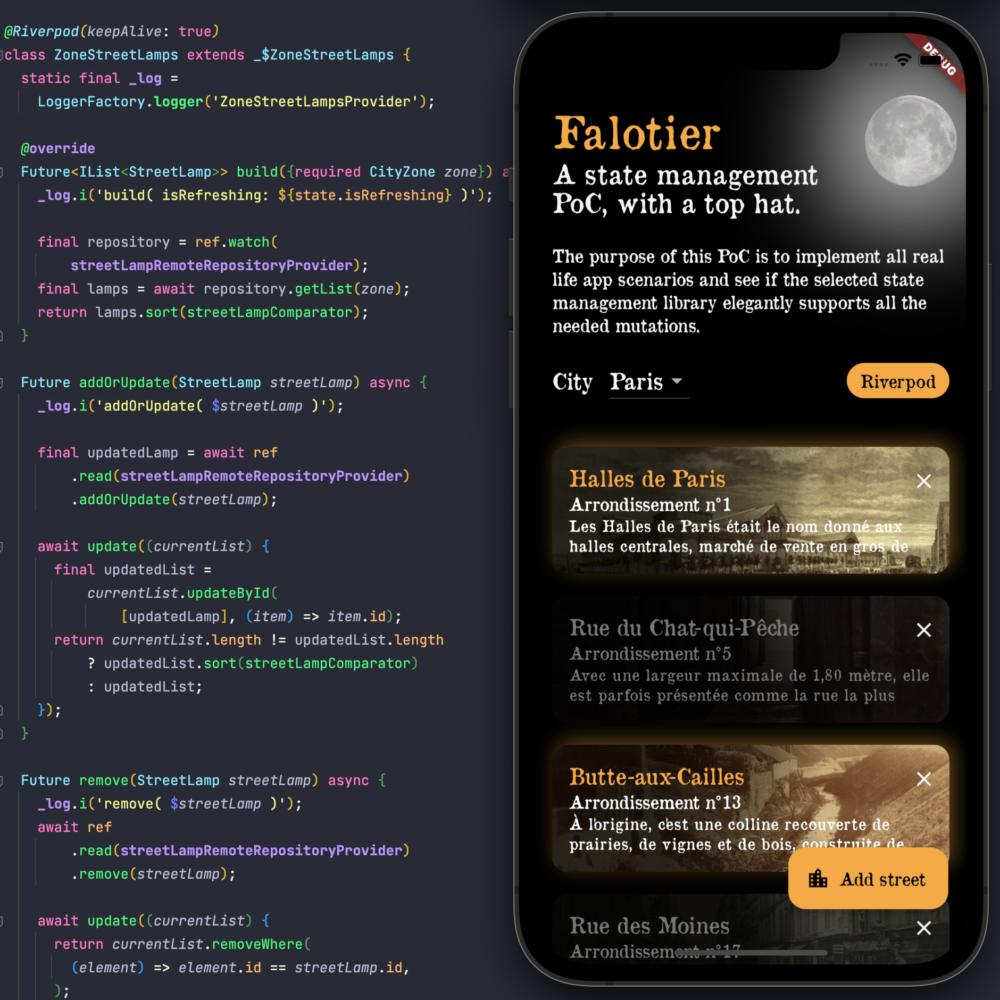

The purpose of this PoC is to implement all real life app scenarios and see if the selected state management library elegantly supports all the needed mutations.

The selected state management library: [Riverpod](https://riverpod.dev).




I am a `Riverpod` enthusiast, but coming from a MVVM oriented world, I had my share of doubts and interrogations.
I read a lot of examples, but I couldn't find a sample app that covers the scenarios I always meet when I am building an app for a client.


So I decided to see if I could build an app that supports the most classic use-cases from real-life app with `Riverpod`.
And here is the result.

## Document in progress

Follow me on twitter @Piskariov, [linkedin](https://www.linkedin.com/in/alfonsi/) or subscribe to my blog [sharpnado](https://www.sharpnado.com/#/portal/signup) to receive all future explanations of falotier's implementation!

- [x] Showcase `falotier_riverpod` ([blog post](https://www.sharpnado.com/falotier-riverpod))
- [x] Enumerate all the app loading states
- [x] General architecture
- [ ] Implementation details of `loading from scratch`
- [ ] Implementation details of `refreshing`
- [ ] Implementation details of `list update`
- [ ] Implementation details of `item details update`

## Supported use-cases

In Falotier, I try to support as much real-life use cases.\
You have a list of streets with a street lamp which is lit or not.

As a Falotier:
* You can assign new streets to you by taping to the `Add Street` button,
* You can lighten your burden by taping on the cross of an item,
* You must lit the street lamp when the night is coming by taping on the street lamp bulb,
* You must turn off the street lamp when the night is over with the same gesture.

https://user-images.githubusercontent.com/596903/202012055-60936a90-c675-4506-86a9-18c7fcb08900.mp4


### Loading from scratch

The loading of an empty screen.\
If the loading is successful, we display our result.\
Or we display an informative message to the user and we give him the possibility to retry.


### Riverpod implementation

Coming soon...For now feel free to browse the code.

### Refreshing

When an item is already loaded and we want to refresh it.\
Typically the `pull-to-refresh` of a list.\
If the refresh is successful, we update our whole list.\
It there is an error during the refresh, we show a `SnackBar`.


### Riverpod implementation

Coming soon...For now feel free to browse the code.

### List update 

#### Adding a new item in the list
We tap on the `FloatingActionButton`, it opens a modal displaying our available streets.\
We select one, we call an `update` method on our server side.\
During the call, we show an overlay.\
If the remote call is successful we update our list state and close the modal.\
If there was a error during the call, we display a `SnackBar` to our user.

#### Riverpod implementation

Coming soon...For now feel free to browse the code.


#### Removing an item from a list

We tap on an item cross.\
We call a `remove` method on our server side.\
During the call, we transform our cross icon to a loading widget.\
If the remote call is successful we update our list state and the item is removed.\
If there was a error during the call, we display a `SnackBar` to our user.

https://user-images.githubusercontent.com/596903/201427126-e86240b6-d567-4178-9adf-d65b2f532ba0.mp4

#### Riverpod implementation

Coming soon...For now feel free to browse the code.

### Item details update

By taping to a list item, we navigate to a street.\
By taping on the street lamp, we toggle its light.\
This is calling a method on the server side.\
During the remote call, we display an animation of the light which is growing or fading.\
If it fails, the previous state is restored and we display a `SnackBar`.


Our architecture must of course propagate the new immutable item to the item list.

https://user-images.githubusercontent.com/596903/201427337-d67bbf4a-46ae-41df-b2ce-80f3d0b9cc94.mp4

## The application architecture

There is a never-ending debate on how you should structure your application code.
You could use several architectures, but the selected architecture should be:

1. Easy to understand

* It means that an average developer shouldn't need a 2 weeks training to be able to understand it.
* It's good to start from a well-known architecture, and adapt it to your needs. Well-known architecture have been adopted for a reason: they passed the test of time.

2. Easy to modify

* It means you don't need to implement 4 interfaces and 2 DTOs when you want to add a new entity type to your architecture. 
* It also mean you won't have to implement an abstract method from a grand parent object in order to fix a bug.
* It probably means refrain yourself from using too much inheritance: always prefer composition vs inheritance.
* Most importantly, it means that when a developer want to add a feature, he should know how to do it instantly. He shouldn't lost 3 days thinking about the best way to add the feature in the architecture.

### A simplified DDD architecture

For nearly 10 years now I'm using a simplified `DDD` architecture that is widely adopted and understandable.
It means it uses concepts that everyone understand like: repositories, entities and services (providers).


It has 3 layers, from lowest to highest:

1. `Infrastructure`

The is the lower technical stuff like logging, tools, storage...

2. `Domain`

This is where you put all your business logic, your repositories, your entities, your services.
The difference with classic `DDD` is **that services are here implemented with providers**, achieving a global reactive caching system.

3. `Presentation`

This is all your UI stuff, routes, pages, widget, animation, etc...

`Presentation` depends on `Domain` which depends on `Infrastructure`.
This is the **only** way allowed.
Your infrastructure **cannot** reference your domain layer for example.

#### What about the Application layer ?

Well, first people tend to misunderstand this layer coined in the blue book and you have as many interpretations as implementations. 
For example, I saw people mixing the concept of domain services with application services.

But mostly: because you don't need another layer.
Keep it simple.


#### Why not a feature-driven architecture?

Lately, I saw some posts and articles promoting feature-oriented architecture.
It means that you will reproduce this DDD architecture for each feature, for example:

```
‣ lib
  ‣ src
    ‣ features
      ‣ feature1
        ‣ presentation
        ‣ domain
        ‣ infrastructure
      ‣ feature2
        ‣ presentation
        ‣ domain
        ‣ infrastructure
```

I already tried this approach in the past, and it will fail to meet the "easy to modify" rule.

First you have to choose what a feature is:\
Is the feature related to the domain or the UI?

If you choose to split your code according to the domain, you will spend your time trying to find your UI code.

If you choose to split your code according to your UI pages, you are basically perverting the domain with UI design.

You should think domain first.
Doing that you will duplicate domain logic across your features.
For example let's consider an `Order` entity, on which you will apply all actions regarding orders like:
* `Cancel`
* `Update`
* `Add`
* `Confirm`
* `GetHistory`

We can clearly see the service presenting all those actions will span across various features of your application like:
* `OrderHistoryPage`
* `ShoppingCartPage`
* `OrderDetailsPage`

So what will you do with this service?
Split it in multiple services across all features?
Create a unique service shared across all features?

You will also think very deeply to the concept of feature:
* Is it UI related?
* Is it domain related?
* How do you split all those concepts?

This will not be straightforward, and it's very likely that you will have to move things around cause you didn't get it right the first time...
Productivity will suffer.

The simple "classic" layer architecture has a very dig advantage: it's straightforward, and everyone will understand where to find the code he wants.

It's not ideal, not maybe the most elegant code organization, but it's the most efficient I know so far.

### 1. Infrastructure


Not much to say.
Just the really basic technical thing unrelated to the domain or the UI.

If I had a local storage implementation, i'd put it here for example.

### 2. Domain


#### Entities

Each domain is grouped around an entity.
Here we have our `StreetLamp` which is our main entity.

```dart
part 'street_lamp.freezed.dart';

int streetLampComparator(StreetLamp s1, StreetLamp s2) {
  return streetComparator(s1.street, s2.street);
}

@freezed
class StreetLamp with _$StreetLamp {
  const StreetLamp._();
  const factory StreetLamp({
    required String id,
    required Street street,
    required bool isLit,
  }) = _StreetLamp;

  factory StreetLamp.fromStreet(Street street) {
    return StreetLamp(id: "new", street: street, isLit: false);
  }

  @override
  String toString() {
    return 'StreetLamp( id: $id, name: ${street.name}, isLit: $isLit )';
  }
}
```

All the entities are immutable thanks to [freezed](https://pub.dev/packages/freezed).

#### Repositories

We retrieve entities from repositories.
A repository can be local or remote.
A local repository is most of the time a database like `Hive` or `Isar`;

The interesting thing, is that the consumer of the repository shouldn't know what kind of repository it is. He is just interested in getting those entities.

This is why we use interfaces: to establish a contract.
So the consumer only knows about the interface and nothing about the implementation.
Doing so, we can easily swap an implementation for another.

```dart
import 'impl/remote_repository_mock.dart';
import 'street_lamp.dart';

final streetLampRemoteRepositoryProvider = Provider<StreetLampRemoteRepository>(
    (ref) => ref.watch(streetLampRemoteRepositoryMockProvider));

abstract class StreetLampRemoteRepository {
  Future<StreetLamp> get(String id);
  Future<IList<StreetLamp>> getList(CityZone zone);
  Future<StreetLamp> addOrUpdate(StreetLamp streetLamp);
  Future remove(StreetLamp streetLamp);
}
```

##### Mocks

I always use interfaces when I want to mock a repository or a service.

With mocks: 
* You can deeply test multiple scenarios for your application,
* you can also create a local demo of your app.

We retrieve our entities from a mock repository, emulating a remote call to a server.

```dart
import '../interfaces.dart';
import '../street_lamp.dart';

final streetLampRemoteRepositoryMockProvider =
    Provider<StreetLampRemoteRepositoryMock>((ref) =>
        StreetLampRemoteRepositoryMock(
            ref.read(cityZoneRemoteRepositoryMockProvider)));

class StreetLampRemoteRepositoryMock implements StreetLampRemoteRepository {
  static final _log = LoggerFactory.logger('StreetLampRemoteRepositoryMock');

  static int _nextId = 2001;

  final CityZoneRemoteRepositoryMock _cityZoneRemoteRepositoryMock;
  final _emulator = RemoteCallEmulator(exceptionProbability: 0);

  Map<CityZone, Map<String, StreetLamp>>? _zoneLamps;

  StreetLampRemoteRepositoryMock(this._cityZoneRemoteRepositoryMock);

  @override
  Future<StreetLamp> addOrUpdate(StreetLamp streetLamp) async {
    _log.i('addOrUpdate( $streetLamp )');

    await _emulator.makeRemoteCall();

    if (streetLamp.id == 'new') {
      streetLamp = streetLamp.copyWith(id: (_nextId++).toString());
    }

    _zoneLamps![streetLamp.street.zone]![streetLamp.id] = streetLamp;

    return streetLamp;
  }
   
  ...
}
```

#### Providers as services

In the DDD terminology we normally have services that will deal with our entities actions and states. Since we are using `Riverpod`, and to unlock the full potential of the library, we implement our services as providers.

```dart
import 'street_lamp.dart';

part 'providers.g.dart';

@Riverpod(keepAlive: true)
class ZoneStreetLamps extends _$ZoneStreetLamps {
  static final _log = LoggerFactory.logger('ZoneStreetLampsProvider');

  @override
  Future<IList<StreetLamp>> build({required CityZone zone}) async {
    _log.i('build( isRefreshing: ${state.isRefreshing}, '
        'isReloading: ${state.isReloading}, '
        'hasValue: ${state.hasValue} )');

    final repository = ref.watch(streetLampRemoteRepositoryProvider);
    final lamps = await repository.getList(zone);
    return lamps.sort(streetLampComparator);
  }

  Future addOrUpdate(StreetLamp streetLamp) async {
    _log.i('addOrUpdate( $streetLamp )');

    final repository = ref.read(streetLampRemoteRepositoryProvider);
    final updatedLamp = await repository.addOrUpdate(streetLamp);

    await update((currentList) {
      final updatedList =
          currentList.updateById([updatedLamp], (item) => item.id);
      return currentList.length != updatedList.length
          ? updatedList.sort(streetLampComparator)
          : updatedList;
    });
  }

  Future remove(StreetLamp streetLamp) async {
    _log.i('remove( $streetLamp )');

    final repository = ref.read(streetLampRemoteRepositoryProvider);
    await repository.remove(streetLamp);

    await update((currentList) {
      return currentList.removeWhere(
        (element) => element.id == streetLamp.id,
      );
    });
  }
}

```

Using providers also bring a caching feature. 

So we don't need a local repository to cache our objects in memory.
Of course, if we'd need a persistent caching solution, we would need one, maybe implemented with `Hive` or `Isar`.

Here we can see I use the `keepAlive` option so that my provider will have the same lifetime that my app. Using this property brings us domain-level in-memory caching.

#### What about dependency injection?

All the idea behind `Riverpod` is to have a reactive states of all provided objects.
This is why we always want to use the `ref.watch` method. It's kind like a reactive service locator. Injecting dependencies through constructor would defeat the reactive nature of our architecture. Would defeat what makes `Riverpod` so great.

#### What about naming?

I made the choice to regroup providers and interfaces in a simple file respectively named, `providers` and `interfaces.dart`.

Thanks to modern IDE, we can use such simplification that could bring some clarity to our folders.


This is just a detail, but I find it quite easy to navigate through the code.

### 3. Presentation


Usually I try the folders follow the navigation of the app.
But when I have a very simple app, I just prefer to have them accessible at the same level.

For example, if I had an app with 3 tabs, that would be my top folders.

#### Views

The page you can navigate to have `Screen` suffix.
The widget that are local to the screen are located in the same folder.
If a widget if reused through the app, it would go to a widget folder. Normally.

But in that app, I used an external package that bring all the design to the app.
It is added as a submodule in the `packages` folder.


All my styles and semantics are in this package. 
It frees the presentation layer from all constants regarding spacing, colors, or even text sizes:

```dart
Widget build(context, ref) {
  final theme = AppTheme.of(context);
  final safePaddingTop = MediaQuery.of(context).padding.top;

  ...

  CustomScrollView(
    slivers: [
      SliverToBoxAdapter(
        child: Stack(
          children: [
            Padding(
              padding: const AppEdgeInsets.regular()
                  .toEdgeInsets(theme)
                  .add(EdgeInsets.only(top: safePaddingTop)),
              child: Column(
                crossAxisAlignment: CrossAxisAlignment.start,
                children: [
                  AppText.pageTitle(
                    'Falotier',
                    color: theme.colors.accent,
                  ),
                  const Padding(
                    padding: EdgeInsets.only(right: 100),
                    child: AppText.subtitleLarge(
                      'A state management PoC, with a top hat.',
                      maxLines: 2,
                    ),
                  ),
                  const AppGap(AppGapSize.semiBig),
                  const AppText.paragraphLarge(
                      'The purpose of this PoC is to implement all real life app '
                      'scenarios and see if the selected state management library '
                      'elegantly supports all the needed mutations.'),
                  const AppGap(AppGapSize.regular),
                  SizedBox(
                    height: 50,
                    child: Row(
                      crossAxisAlignment: CrossAxisAlignment.center,
                      children: [
                        const AppText.subtitleMedium('City'),
                        const AppGap(AppGapSize.regular),
                        const CityDropDown(),
                        const Spacer(),
                        Chip(
                            backgroundColor: theme.colors.accent,
                            label: AppText.paragraphLarge(
                              'Riverpod',
                              color: theme.colors.onAccent,
                            ))
                      ],
                    ),
                  ),
                ],
              ),
            ),
```

In a company you're likely to have a design system created by your designers.
This package is simply the implementation of the design system.
Having a package allow you to quickly reuse this design system in another app.

For the implementation of a design system as a dart package, I followed [Aloïs Deniel](https://github.com/aloisdeniel) guidance.
Please have a look at [this great video](https://www.youtube.com/watch?v=lTy8odHcS5s).

#### ViewModel, Controllers, Models, ...

I came from the `C# WPF Xamarin MVVM` world, so, of course I tried to reproduce mvvm in `Flutter`. You could use mvvm in flutter, but I would advise you to use a mvvm oriented library for this like [stacked](https://pub.dev/packages/stacked) or even bloc or cubit.

If if you want to unleash the reactive power of riverpod, you need to use providers and watch the states of your objects. So you don't want an intermediate layer between your providers and your widgets.

But the good news is that you can still have providers at the presentation-level depending on those at the domain-level.

Let's have a look at the `providers.dart` file in the `home` folder:

```dart
class SelectedZone extends _$SelectedZone {
  static final _log = LoggerFactory.logger('SelectedZoneProvider');

  @override
  Future<CityZone> build() async {
    _log.i(
        'build( isRefreshing: ${state.isRefreshing}, isReloading: ${state.isReloading}, hasValue: ${state.hasValue} )');

    // Domain need to be initialized
    await ref.watch(domainInitializerProvider.future);

    final zones = await ref.watch(availableZonesProvider.future);
    _log.listCount(zones);
    return zones[0];
  }

  @override
  bool updateShouldNotify(
    AsyncValue<CityZone> previous,
    AsyncValue<CityZone> next,
  ) {
    if (previous.hasValue && next.hasValue) {
      bool shouldUpdate = previous.value!.id != next.value!.id;
      _log.i('shouldUpdate: $shouldUpdate');
      return shouldUpdate;
    }

    return super.updateShouldNotify(previous, next);
  }

  void reload() {
    _log.i('reload()');

    ref.invalidate(availableZonesProvider);
  }

  select(CityZone zone) {
    _log.i('select( $zone )');
    update((previousZone) => zone);
  }
}
```

This provider keep the state of the selected city in the home page.


But it's just maintaining the state in the UI layer, so you can have different caching strategy or lifetime than your domain layer.

You can also use providers to transform a domain object to a UI object. If you like it that way. Nowadays I just put computed properties that will be displayed in my UI as late properties in my domain objects... 

Don't waste time with complexities that add no values.

### Wrapping-up

`Falotier` is following a very simplified DDD architecture.
The most important aspect of architecting apps, is the simplicity of it.

Don't try to reinvent the wheel, just adapt a well-known architecture to your needs.
Never forget that you're not alone in your team (well if you are, do whatever you want :), always think about your colleagues that will suffer from your incredible state of the art abstractions requiring DTO, adapters, mappers, Unit of Work and interceptors.\
Make all things obvious.

Riverpod is the most impressive state management library I've seen for many years (I built a lot of C# architecture). To display its full power you have to adapt yourself, you have to implement its philosophy.

Don't resist: embrace it :)


## The design

I implemented a theme with a separate flutter project called falotier_design.\
It's like I had a design system and implemented it with a theme, giving semantics to colors, spaces, text, etc...\
I also have a collection of `Widgets` in this library that I use in my apps.

For this I followed [Aloïs Deniel](https://github.com/aloisdeniel) guidance.\
Please have a look at [this great video](https://www.youtube.com/watch?v=lTy8odHcS5s).

You can also [check its repo](https://github.com/aloisdeniel/asgard_shop).

### The street details composition

The street detail screen is built dynamically with composition of image and stacks of gradients.

Coming soon...For now feel free to browse the code.

## The story behind

Coming soon...For now feel free to imagine it.
