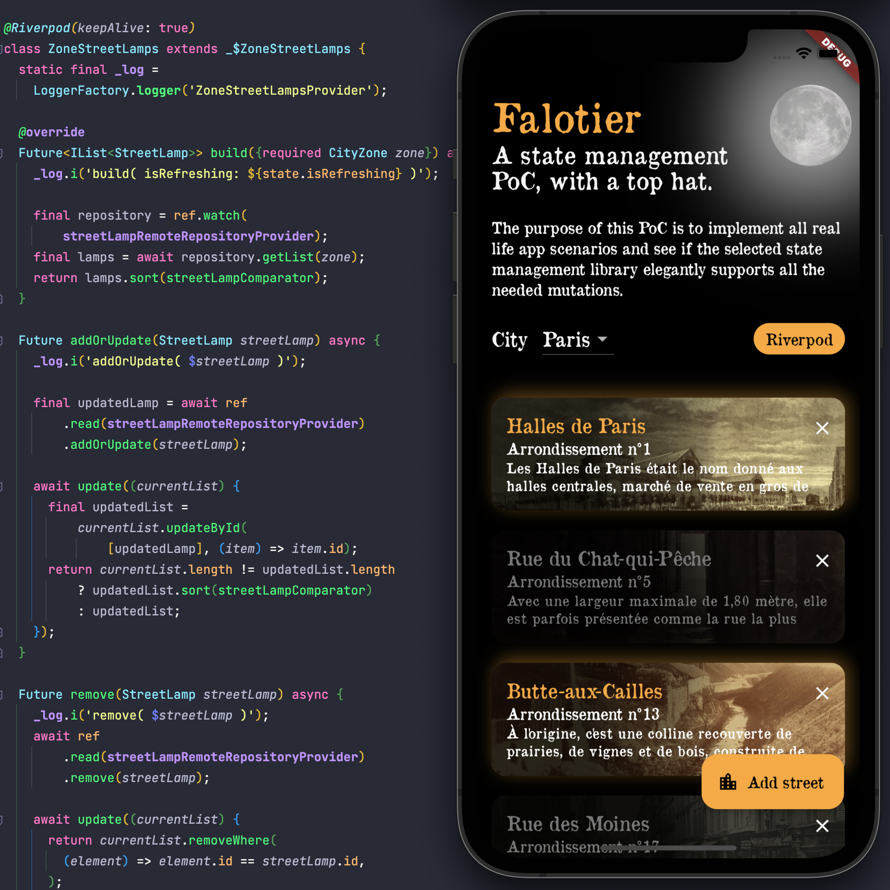

The purpose of this PoC is to implement all real life app scenarios and see if the selected state management library elegantly supports all the needed mutations.

The selected state management library: [Riverpod](https://riverpod.dev).




I am a `Riverpod` enthusiast, but coming from a MVVM oriented world, I had my share of doubts and interrogations.
I read a lot of examples, but I couldn't find a sample app that covers the scenarios I always meet when I am building an app for a client.


So I decided to see if I could build an app that supports the most classic use-cases from real-life app with `Riverpod`.
And here is the result.

## Document in progress

Follow me on twitter @Piskariov, [linkedin](https://www.linkedin.com/in/alfonsi/) or subscribe to my blog [sharpnado](https://www.sharpnado.com/#/portal/signup) to receive all future explanations of falotier's implementation!

- [x] Showcase `falotier_riverpod` ([blog post](https://www.sharpnado.com/falotier-riverpod))
- [x] Enumerate all the app loading states
- [x] General architecture
- [x] Normalized entity store (`StreetLampStore` + derived views)
- [x] Centralized command error handling (`runCommand` helper)
- [x] Implementation details of `loading from scratch` ([Case 1](load_from_scratch.md) / [Case 2](load_from_scratch_case2.md))
- [x] Implementation details of `refreshing` ([refreshing.md](refreshing.md))
- [x] Implementation details of `list update` ([list_update.md](list_update.md))
- [x] Implementation details of `item details update` ([item_details_update.md](item_details_update.md))

The architectural decisions and their trade-offs are documented in `proposed_improvements/` (with `validated/` and `implemented/` subfolders tracking the lifecycle of each proposal).

## Supported use-cases

In Falotier, I try to support as much real-life use cases.\
You have a list of streets with a street lamp which is lit or not.

As a Falotier:
* You can assign new streets to you by taping to the `Add Street` button,
* You can lighten your burden by taping on the cross of an item,
* You must lit the street lamp when the night is coming by taping on the street lamp bulb,
* You must turn off the street lamp when the night is over with the same gesture.

https://user-images.githubusercontent.com/596903/202012055-60936a90-c675-4506-86a9-18c7fcb08900.mp4


### Loading from scratch

The loading of an empty screen.\
If the loading is successful, we display our result.\
Or we display an informative message to the user and we give him the possibility to retry.


### Riverpod implementation

- [1. Simplest use case: only one dependency](load_from_scratch.md)
- [2. A sequence of dependencies, each with its own loading message and retry](load_from_scratch_case2.md)

### Refreshing

When an item is already loaded and we want to refresh it.\
Typically the `pull-to-refresh` of a list.\
If the refresh is successful, we update our whole list.\
It there is an error during the refresh, we show a `SnackBar`.


### Riverpod implementation

[Refreshing: keep the old data visible, surface errors as SnackBars](refreshing.md)

### List update 

#### Adding a new item in the list
We tap on the `FloatingActionButton`, it opens a modal displaying our available streets.\
We select one, we call an `update` method on our server side.\
During the call, we show an overlay.\
If the remote call is successful we update our list state and close the modal.\
If there was a error during the call, we display a `SnackBar` to our user.

#### Riverpod implementation

[List update: pessimistic add/remove with DiffUtil animations](list_update.md)


#### Removing an item from a list

We tap on an item cross.\
We call a `remove` method on our server side.\
During the call, we transform our cross icon to a loading widget.\
If the remote call is successful we update our list state and the item is removed.\
If there was a error during the call, we display a `SnackBar` to our user.

https://user-images.githubusercontent.com/596903/201427126-e86240b6-d567-4178-9adf-d65b2f532ba0.mp4

#### Riverpod implementation

[List update: pessimistic add/remove with DiffUtil animations](list_update.md)

### Item details update

By taping to a list item, we navigate to a street.\
By taping on the street lamp, we toggle its light.\
This is calling a method on the server side.\
During the remote call, we display an animation of the light which is growing or fading.\
If there is an error during the call, a `SnackBar` is displayed and the lamp stays in its previous state.


The toggle mutation lives on `StreetLampStore` and is **pessimistic**: the canonical `isLit` value is only flipped after the server confirms. The flame animation (`FlameAction { idle, turningOn, turningOff }`) provides the instant visual feedback during the wait — we don't need optimistic state.

Our architecture propagates the new immutable item everywhere for free: the store is the single source of truth, both the list and the detail screen are derived views, so one write updates both.

https://user-images.githubusercontent.com/596903/201427337-d67bbf4a-46ae-41df-b2ce-80f3d0b9cc94.mp4

### Riverpod implementation

[Item details update: pessimistic toggle with animation, single source of truth](item_details_update.md)

## The application architecture

There is a never-ending debate on how you should structure your application code.
You could use several architectures, but the selected architecture should be:

1. Easy to understand

* It means that an average developer shouldn't need a 2 weeks training to be able to understand it.
* It's good to start from a well-known architecture, and adapt it to your needs. Well-known architecture have been adopted for a reason: they passed the test of time.

2. Easy to modify

* It means you don't need to implement 4 interfaces and 2 DTOs when you want to add a new entity type to your architecture. 
* It also mean you won't have to implement an abstract method from a grand parent object in order to fix a bug.
* It probably means refrain yourself from using too much inheritance: always prefer composition vs inheritance.
* Most importantly, it means that when a developer want to add a feature, he should know how to do it instantly. He shouldn't lost 3 days thinking about the best way to add the feature in the architecture.

### A simplified DDD architecture

For nearly 10 years now I'm using a simplified `DDD` architecture that is widely adopted and understandable.
It means it uses concepts that everyone understand like: repositories, entities and services (providers).


It has 3 layers, from lowest to highest:

1. `Infrastructure`

The is the lower technical stuff like logging, tools, storage...

2. `Domain`

This is where you put all your business logic, your repositories, your entities, your services.
The difference with classic `DDD` is **that services are here implemented with providers**, achieving a global reactive caching system.

3. `Presentation`

This is all your UI stuff, routes, pages, widget, animation, etc...

`Presentation` depends on `Domain` which depends on `Infrastructure`.
This is the **only** way allowed.
Your infrastructure **cannot** reference your domain layer for example.

#### What about the Application layer ?

Well, first people tend to misunderstand this layer coined in the blue book and you have as many interpretations as implementations. 
For example, I saw people mixing the concept of domain services with application services.

But mostly: because you don't need another layer.
Keep it simple.


#### Why not a feature-driven architecture?

Lately, I saw some posts and articles promoting feature-oriented architecture.
It means that you will reproduce this DDD architecture for each feature, for example:

```
‣ lib
  ‣ src
    ‣ features
      ‣ feature1
        ‣ presentation
        ‣ domain
        ‣ infrastructure
      ‣ feature2
        ‣ presentation
        ‣ domain
        ‣ infrastructure
```

I already tried this approach in the past, and it will fail to meet the "easy to modify" rule.

First you have to choose what a feature is:\
Is the feature related to the domain or the UI?

If you choose to split your code according to the domain, you will spend your time trying to find your UI code.

If you choose to split your code according to your UI pages, you are basically perverting the domain with UI design.

You should think domain first.
Doing that you will duplicate domain logic across your features.
For example let's consider an `Order` entity, on which you will apply all actions regarding orders like:
* `Cancel`
* `Update`
* `Add`
* `Confirm`
* `GetHistory`

We can clearly see the service presenting all those actions will span across various features of your application like:
* `OrderHistoryPage`
* `ShoppingCartPage`
* `OrderDetailsPage`

So what will you do with this service?
Split it in multiple services across all features?
Create a unique service shared across all features?

You will also think very deeply to the concept of feature:
* Is it UI related?
* Is it domain related?
* How do you split all those concepts?

This will not be straightforward, and it's very likely that you will have to move things around cause you didn't get it right the first time...
Productivity will suffer.

The simple "classic" layer architecture has a very dig advantage: it's straightforward, and everyone will understand where to find the code he wants.

It's not ideal, not maybe the most elegant code organization, but it's the most efficient I know so far.

### 1. Infrastructure


Not much to say.
Just the really basic technical thing unrelated to the domain or the UI.

If I had a local storage implementation, i'd put it here for example.

### 2. Domain


This layer holds entities, repositories, and providers-as-services. The current `Domain` layer hosts:
- the `StreetLamp` entity + repository
- the `CityZone` entity + repository
- the `StreetLampStore` (single source of truth for lamps) + derived views (`zoneLamps`, `streetLamp`)
- the `SelectedZone` app-state provider (which zone the user is currently browsing) — yes, in domain, because it's not widget-local ephemeral state, it's a domain-level selection that drives the store's `build()`

#### Entities

Each domain is grouped around an entity.
Here we have our `StreetLamp` which is our main entity.

```dart
part 'street_lamp.freezed.dart';

int streetLampComparator(StreetLamp s1, StreetLamp s2) {
  return streetComparator(s1.street, s2.street);
}

@freezed
class StreetLamp with _$StreetLamp {
  const StreetLamp._();
  const factory StreetLamp({
    required String id,
    required Street street,
    required bool isLit,
  }) = _StreetLamp;

  factory StreetLamp.fromStreet(Street street) {
    return StreetLamp(id: "new", street: street, isLit: false);
  }

  @override
  String toString() {
    return 'StreetLamp( id: $id, name: ${street.name}, isLit: $isLit )';
  }
}
```

All the entities are immutable thanks to [freezed](https://pub.dev/packages/freezed).

#### Repositories

We retrieve entities from repositories.
A repository can be local or remote.
A local repository is most of the time a database like `Hive` or `Isar`;

The interesting thing, is that the consumer of the repository shouldn't know what kind of repository it is. He is just interested in getting those entities.

This is why we use interfaces: to establish a contract.
So the consumer only knows about the interface and nothing about the implementation.
Doing so, we can easily swap an implementation for another.

```dart
import 'impl/remote_repository_mock.dart';
import 'street_lamp.dart';

final streetLampRemoteRepositoryProvider = Provider<StreetLampRemoteRepository>(
    (ref) => ref.watch(streetLampRemoteRepositoryMockProvider));

abstract class StreetLampRemoteRepository {
  Future<StreetLamp> get(String id);
  Future<IList<StreetLamp>> getList(CityZone zone);
  Future<StreetLamp> addOrUpdate(StreetLamp streetLamp);
  Future remove(StreetLamp streetLamp);
}
```

##### Mocks

I always use interfaces when I want to mock a repository or a service.

With mocks: 
* You can deeply test multiple scenarios for your application,
* you can also create a local demo of your app.

We retrieve our entities from a mock repository, emulating a remote call to a server.

```dart
import '../interfaces.dart';
import '../street_lamp.dart';

final streetLampRemoteRepositoryMockProvider =
    Provider<StreetLampRemoteRepositoryMock>((ref) =>
        StreetLampRemoteRepositoryMock(
            ref.read(cityZoneRemoteRepositoryMockProvider)));

class StreetLampRemoteRepositoryMock implements StreetLampRemoteRepository {
  static final _log = LoggerFactory.logger('StreetLampRemoteRepositoryMock');

  static int _nextId = 2001;

  final CityZoneRemoteRepositoryMock _cityZoneRemoteRepositoryMock;
  final _emulator = RemoteCallEmulator(exceptionProbability: 0);

  Map<CityZone, Map<String, StreetLamp>>? _zoneLamps;

  StreetLampRemoteRepositoryMock(this._cityZoneRemoteRepositoryMock);

  @override
  Future<StreetLamp> addOrUpdate(StreetLamp streetLamp) async {
    _log.i('addOrUpdate( $streetLamp )');

    await _emulator.makeRemoteCall();

    if (streetLamp.id == 'new') {
      streetLamp = streetLamp.copyWith(id: (_nextId++).toString());
    }

    _zoneLamps![streetLamp.street.zone]![streetLamp.id] = streetLamp;

    return streetLamp;
  }
   
  ...
}
```

#### Providers as services

In the DDD terminology we normally have services that will deal with our entities actions and states. Since we are using `Riverpod`, and to unlock the full potential of the library, we implement our services as providers.

##### The normalized entity store

A single entity should have a single source of truth in the provider graph. Originally falotier had two providers holding `StreetLamp` instances: `ZoneStreetLamps(zone:)` for the list and `StreetLampState(id:)` for the detail, with manual cross-provider sync. This drift-prone setup was replaced by a single **normalized store** inspired by Redux EntityAdapter / NgRx Entity.

```dart
@Riverpod(keepAlive: true)
class StreetLampStore extends _$StreetLampStore {
  static final _log = LoggerFactory.logger('StreetLampStore');

  // Getter plutôt qu'un champ 'late final' : build() peut re-tourner après
  // invalidate (pull-to-refresh, change zone), et un champ late final lèverait
  // LateInitializationError _throwFieldAlreadyInitialized.
  StreetLampRemoteRepository get _repo =>
      ref.read(streetLampRemoteRepositoryProvider);

  @override
  Future<Map<String, StreetLamp>> build() async {
    final zone = await ref.watch(selectedZoneProvider.future);
    final lamps = await _repo.getList(zone);
    return {for (final l in lamps) l.id: l};
  }

  Future toggle(String id) async {
    final previous = state.value!;
    final lamp = previous[id]!;
    final updated = lamp.copyWith(isLit: !lamp.isLit);

    await _repo.addOrUpdate(updated);               // pessimistic
    state = AsyncData({...previous, id: updated});  // single write, after success
  }

  Future addOrUpdate(StreetLamp lamp) async {
    final saved = await _repo.addOrUpdate(lamp);
    state = AsyncData({...state.value!, saved.id: saved});
  }

  Future remove(String id) async {
    final lamp = state.value![id]!;
    await _repo.remove(lamp);
    state = AsyncData({...state.value!}..remove(id));
  }
}
```

The store is indexed by id (`Map<String, StreetLamp>`). All mutations are **100% pessimistic**: they `await` the server confirmation before updating state. Optimistic updates with rollback were intentionally not used — local UI feedback (the flame animation in `LitLampWidget`, the global overlay for `remove`) already covers the perceived latency. Adding optimistic state would just duplicate code without visual benefit.

The list and detail screens no longer hold entity state themselves. They are pure **derived views** over the store:

```dart
@riverpod
Future<IList<StreetLamp>> zoneLamps(
  ZoneLampsRef ref, {
  required CityZone zone,
}) async {
  final store = await ref.watch(streetLampStoreProvider.future);
  return store.values
      .where((l) => l.street.zone == zone)
      .toIList()
      .sort(streetLampComparator);
}

@riverpod
Future<StreetLamp> streetLamp(
  StreetLampRef ref, {
  required String id,
}) async {
  final store = await ref.watch(streetLampStoreProvider.future);
  return store[id]!;
}
```

One mutation → every view stays consistent. No more manual sync, no more drift. The store is the canonical pattern for "single source of truth in Riverpod" and the right home for entity-level operations.

Using providers also brings a caching feature. With the `keepAlive` option, the store has the same lifetime as the app — domain-level in-memory caching for free. We don't need a local repository to cache our objects in memory.
(Of course, if we'd need a persistent caching solution, we would need one, maybe implemented with `Hive` or `Isar`.)

#### What about dependency injection?

All the idea behind `Riverpod` is to have a reactive states of all provided objects.
This is why we always want to use the `ref.watch` method. It's kind like a reactive service locator. Injecting dependencies through constructor would defeat the reactive nature of our architecture. Would defeat what makes `Riverpod` so great.

#### What about naming?

I made the choice to regroup providers and interfaces in a simple file respectively named, `providers` and `interfaces.dart`.

Thanks to modern IDE, we can use such simplification that could bring some clarity to our folders.


This is just a detail, but I find it quite easy to navigate through the code.

### 3. Presentation


Usually I try the folders follow the navigation of the app.
But when I have a very simple app, I just prefer to have them accessible at the same level.

For example, if I had an app with 3 tabs, that would be my top folders.

#### Views

The page you can navigate to have `Screen` suffix.
The widget that are local to the screen are located in the same folder.
If a widget if reused through the app, it would go to a widget folder. Normally.

But in that app, I used an external package that bring all the design to the app.
It is added as a submodule in the `packages` folder.


All my styles and semantics are in this package. 
It frees the presentation layer from all constants regarding spacing, colors, or even text sizes:

```dart
Widget build(context, ref) {
  final theme = AppTheme.of(context);
  final safePaddingTop = MediaQuery.of(context).padding.top;

  ...

  CustomScrollView(
    slivers: [
      SliverToBoxAdapter(
        child: Stack(
          children: [
            Padding(
              padding: const AppEdgeInsets.regular()
                  .toEdgeInsets(theme)
                  .add(EdgeInsets.only(top: safePaddingTop)),
              child: Column(
                crossAxisAlignment: CrossAxisAlignment.start,
                children: [
                  AppText.pageTitle(
                    'Falotier',
                    color: theme.colors.accent,
                  ),
                  const Padding(
                    padding: EdgeInsets.only(right: 100),
                    child: AppText.subtitleLarge(
                      'A state management PoC, with a top hat.',
                      maxLines: 2,
                    ),
                  ),
                  const AppGap(AppGapSize.semiBig),
                  const AppText.paragraphLarge(
                      'The purpose of this PoC is to implement all real life app '
                      'scenarios and see if the selected state management library '
                      'elegantly supports all the needed mutations.'),
                  const AppGap(AppGapSize.regular),
                  SizedBox(
                    height: 50,
                    child: Row(
                      crossAxisAlignment: CrossAxisAlignment.center,
                      children: [
                        const AppText.subtitleMedium('City'),
                        const AppGap(AppGapSize.regular),
                        const CityDropDown(),
                        const Spacer(),
                        Chip(
                            backgroundColor: theme.colors.accent,
                            label: AppText.paragraphLarge(
                              'Riverpod',
                              color: theme.colors.onAccent,
                            ))
                      ],
                    ),
                  ),
                ],
              ),
            ),
```

In a company you're likely to have a design system created by your designers.
This package is simply the implementation of the design system.
Having a package allow you to quickly reuse this design system in another app.

For the implementation of a design system as a dart package, I followed [Aloïs Deniel](https://github.com/aloisdeniel) guidance.
Please have a look at [this great video](https://www.youtube.com/watch?v=lTy8odHcS5s).

#### ViewModel, Controllers, Models, ...

I came from the `C# WPF Xamarin MVVM` world, so, of course I tried to reproduce mvvm in `Flutter`. You could use mvvm in flutter, but I would advise you to use a mvvm oriented library for this like [stacked](https://pub.dev/packages/stacked) or even bloc or cubit.

If if you want to unleash the reactive power of riverpod, you need to use providers and watch the states of your objects. So you don't want an intermediate layer between your providers and your widgets.

But the good news is that you can still have providers at the presentation-level depending on those at the domain-level.

The remaining presentation-level provider, `LampList`, is just a thin cache of the selected zone chaining into the store's derived `zoneLamps` view:

```dart
@Riverpod(keepAlive: true)
class LampList extends _$LampList {
  static final _log = LoggerFactory.logger('LampListProvider');

  @override
  Future<IList<StreetLamp>> build() async {
    _log.i('build()');

    final zone = await ref.watch(selectedZoneProvider.future);
    return ref.watch(zoneLampsProvider(zone: zone).future);
  }

  Future<void> refresh() {
    _log.i('refresh()');
    return ref.refresh(streetLampStoreProvider.future);
  }

  void reload() {
    _log.i('reload()');
    ref.invalidate(streetLampStoreProvider);
    ref.invalidateSelf();
  }
}
```

##### What NOT to put in a provider

An earlier iteration had a `LampDetails` provider at the presentation layer that wrapped the lamp detail state and exposed a `toggle()` side-effect. It looked convenient but it violated two Riverpod [DO/DON'T](https://riverpod.dev/docs/root/do_dont) rules:

- **"AVOID using providers for Ephemeral state."** Providers are for shared business state, not for widget-local UI state like animation flags.
- **"DON'T perform side effects during the initialization of a provider."** Providers are read operations, not write operations. Side-effects like `toggle()` belong in mutation methods on the store, not in provider state.

The flame animation state (`FlameAction { idle, turningOn, turningOff }`) is now widget-local in `LitLampWidget` via `setState`. The `toggle()` mutation lives on `StreetLampStore`. The widget just calls `store.toggle(id)` and drives its animation on the local `_action` field. Cleaner, and aligned with Riverpod's official guidance.

The `runCommand` helper in `loading_states_widgets.dart` centralizes the `try/catch/finally` + `handleCommandError` pattern that every action-triggering widget needs:

```dart
Future<void> runCommand({
  required BuildContext context,
  required Future Function() action,
  FutureOr Function()? onSuccess,
  void Function()? onLoadingStart,
  void Function()? onLoadingEnd,
}) async {
  if (onLoadingStart != null) onLoadingStart();
  try {
    await action();
    if (onSuccess != null) await onSuccess();
  } catch (e, t) {
    handleCommandError(context, e, t);
  } finally {
    if (onLoadingEnd != null) onLoadingEnd();
  }
}
```

The error path can never be forgotten on a new call site. The widget retains its local loading state (spinner, animation, overlay) through `onLoadingStart` / `onLoadingEnd` callbacks — that part is widget-local UI state and that's fine. When Riverpod v3 `Mutation` lands, `runCommand` will be replaced by `mutation.run(ref, ...)` but the store-level logic stays untouched.

Don't waste time with complexities that add no values.

### Wrapping-up

`Falotier` is following a very simplified DDD architecture.
The most important aspect of architecting apps, is the simplicity of it.

Don't try to reinvent the wheel, just adapt a well-known architecture to your needs.
Never forget that you're not alone in your team (well if you are, do whatever you want :), always think about your colleagues that will suffer from your incredible state of the art abstractions requiring DTO, adapters, mappers, Unit of Work and interceptors.\
Make all things obvious.

Riverpod is the most impressive state management library I've seen for many years (I built a lot of C# architecture). To display its full power you have to adapt yourself, you have to implement its philosophy.

Don't resist: embrace it :)


## The design

I implemented a theme with a separate flutter project called falotier_design.\
It's like I had a design system and implemented it with a theme, giving semantics to colors, spaces, text, etc...\
I also have a collection of `Widgets` in this library that I use in my apps.

For this I followed [Aloïs Deniel](https://github.com/aloisdeniel) guidance.\
Please have a look at [this great video](https://www.youtube.com/watch?v=lTy8odHcS5s).

You can also [check its repo](https://github.com/aloisdeniel/asgard_shop).

### The street details composition

The street detail screen is built dynamically with composition of image and stacks of gradients.

Coming soon...For now feel free to browse the code.

## The story behind

Coming soon...For now feel free to imagine it.
