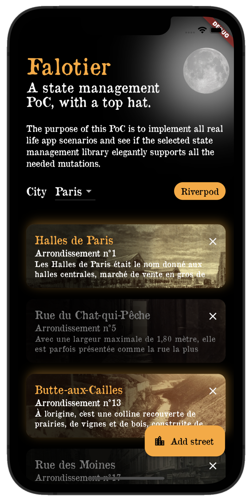
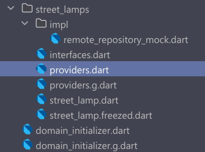
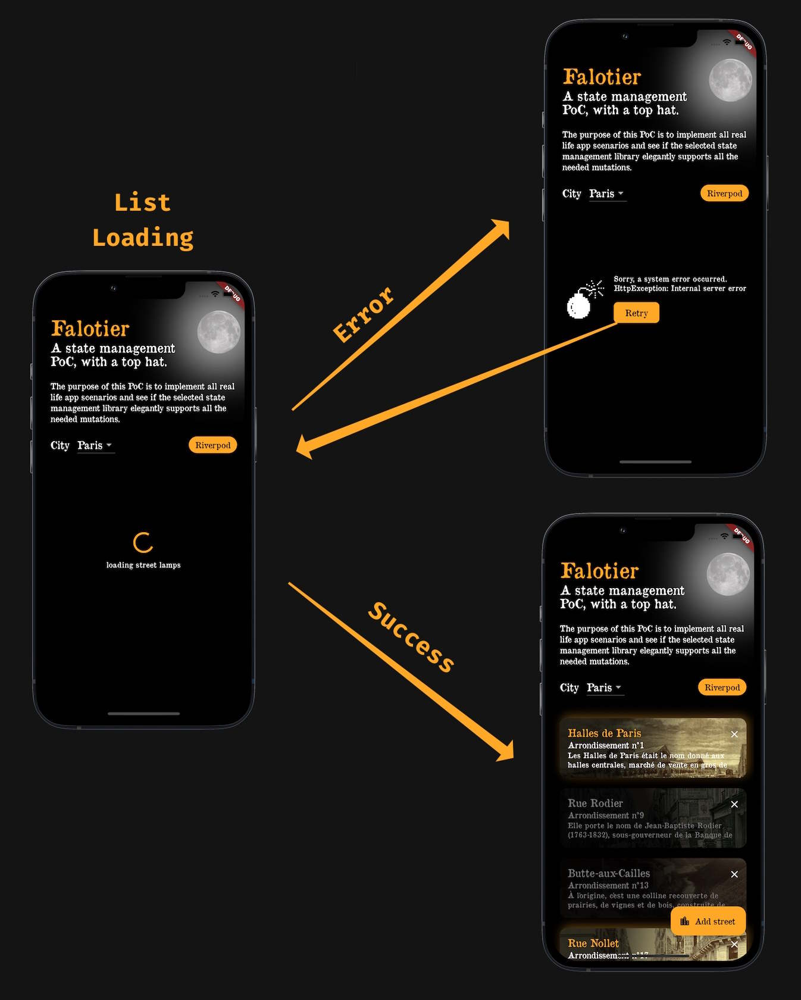
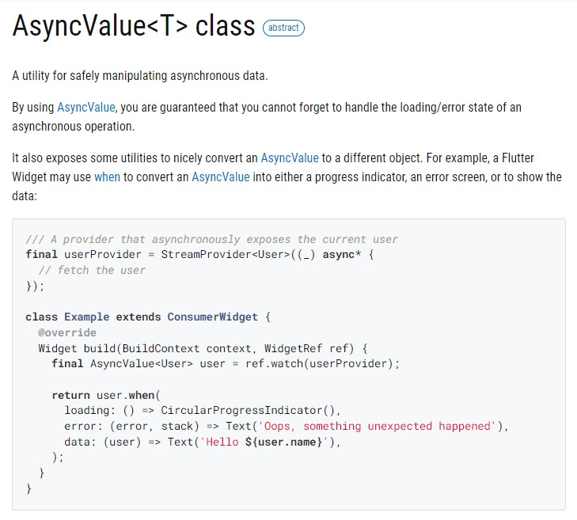

# Loading data with Riverpod: an AsyncValue story

When you start an app, you begin with a splash screen and then what?
You want to pull data from your data source: could be a REST service, could be a local database, could be a json file, could you be loved and be love ?
You usually pull those data from your business layer, aka domain layer, and then you pass this data to your view, so it could be presented to the app user.

Right.
Let's take a very random example.

We are a street lamp lighter in the 19th century, in Paris, and we want to get the street lamps we are responsible of and their respective state (lit/ not lit).



Here is our domain structure (you can read [part II of falotier's series](https://www.sharpnado.com/falotier-riverpod-part-2-architecture/) to have a global understanding).



When using Riverpod, we use providers, and also generation cause it makes the code look so slick. The `.g` files contain the Riverpod generated code for our providers.

For this article, we start with a very simple use case: we just want to load a list of streets:

```dart
// data source
class StreetLampRemoteRepositoryMock implements StreetLampRemoteRepository {
  Future<IList<StreetLamp>> getList() async;  
}

// provider depends on data source
part 'providers.g.dart';

@Riverpod(keepAlive: true)
class StreetLamps extends _$StreetLamps {
  @override
  Future<IList<StreetLamp>> build() async {
    _log.i('build( isRefreshing: ${state.isRefreshing}, '
        'isReloading: ${state.isReloading}, '
        'hasValue: ${state.hasValue} )');

    final repository = ref.watch(streetLampRemoteRepositoryProvider);
    final lamps = await repository.getList(zone);
    return lamps.sort(streetLampComparator);
  }

  void reload() {
    _log.i('reload()');
    ref.invalidateSelf();
  }
}

// street_lamps_screen depends on street lamps provider
class StreetLampList extends ConsumerWidget {
  const StreetLampList({super.key});

  @override
  Widget build(BuildContext context, WidgetRef ref) {
		final asyncValue = ref.watch(StreetLampsProvider());

		return ... what?
  }
}
```


Very simple. `StreetLampList` depends on `streetLampsProvider`, which depends on the repository `StreetLampRemoteRepositoryMock`;
It means that is the `streetLampsProvider` gets rebuild for whatever reason (probably invalidation), it will trigger a rebuild of our widget.

Now the important thing:

**We need to give a perfect feedback of our loading process to our user.**

Cause a loading process has multiple states that *should* be presented to the user:

1. Loading
2. Success
3. Error
4. Refreshing

In this first article we'll just focus on the first 3.
When the loading is a success, it will display the list of our falotier's streets.

But how we will handle point 1 and 3?

Here is a simple diagram of those states and their transitions:



As you can see we need to handle properly the loading state and the error state so the user can have a full understanding of what's going on. Nothing is more frustrating as a user to see a forever spining loader or a blank screen.

## AsyncValue to the rescue

This is where `AsyncValue` is giving its full value.
Let's just rip off riverpod documentation on this matter:



The object is exposing a very uselful `when` method that we can use to build the UI representation of the current loading state.

So what did I do as a lazy developper? Of course I created a `AsyncValueWidget` that is translating each `Riverpod` loading states to a widget!

```dart
class AsyncValueWidget<T> extends StatelessWidget {
  final AsyncValue<T> asyncValue;
  final VoidCallback onErrorButtonTap;
  final String? loadingMessage;
  final Widget Function(T data) childBuilder;
  final bool asSlivers;
  final double containerHeight;
  final String? loggerName;

  late final Logger _log;

  AsyncValueWidget(
    this.asyncValue, {
    required this.onErrorButtonTap,
    required this.childBuilder,
    this.asSlivers = false,
    this.containerHeight = 300,
    this.loadingMessage,
    this.loggerName,
    super.key,
  }) {
    _log = LoggerFactory.logger(loggerName ?? 'AsyncValueWidget');
  }

  @override
  Widget build(BuildContext context) {
    return asyncValue.when(
      skipError: true,
      skipLoadingOnRefresh: false,
      data: _handleSuccess,
      error: _handleError,
      loading: _handleLoading,
    );
  }

  Widget _handleSuccess(T data) {
    _log.i('_handleSuccess()');
    final result = childBuilder(data);
    return result;
  }

  Widget _handleLoading() {
    _log.i('_handleLoading()');
    final loadingWidget = SizedBox(
      height: containerHeight,
      child: Center(
        child: AppLoadingWidget(
          loadingMessage: loadingMessage,
        ),
      ),
    );

    final adaptedLoadingWidget = asSlivers
        ? SliverToBoxAdapter(
            child: loadingWidget,
          )
        : loadingWidget;

    return adaptedLoadingWidget;
  }

  Widget _handleError(Object error, StackTrace trace) {
    _log.e('Error in async loading', error: error, stackTrace: trace);

    final errorWidget = SizedBox(
      height: containerHeight,
      child: Center(
        child: AppErrorWidget(_errorToString(error), onErrorButtonTap),
      ),
    );

    final adaptedErrorWidget = asSlivers
        ? SliverToBoxAdapter(
            child: errorWidget,
          )
        : errorWidget;

    return adaptedErrorWidget;
  }
}
```

We can see that I have a `AppLoadingWidget`  and a `AppErrorWidget` that are in charge of displaying the UI feedback to the user. Those are also simple.
The loader is just a spinner and the error widget display the error message and a button to be able to retry.

```dart
class AppLoadingWidget extends StatelessWidget {
  const AppLoadingWidget({this.loadingMessage, super.key});

  final String? loadingMessage;

  @override
  Widget build(BuildContext context) {
    final theme = AppTheme.of(context);
    final loadingIndicator =
        CircularProgressIndicator(color: theme.colors.accent);

    if (loadingMessage != null) {
      return Column(
        mainAxisSize: MainAxisSize.min,
        children: [
          loadingIndicator,
          const AppGap.regular(),
          AppText.paragraphMedium(loadingMessage!),
        ],
      );
    }

    return loadingIndicator;
  }
}

class AppErrorWidget extends StatelessWidget {
  final String _errorMessage;
  final void Function() _onTap;
  final String buttonText;

  const AppErrorWidget(
    this._errorMessage,
    this._onTap, {
    super.key,
    this.buttonText = 'Retry',
  });

  @override
  Widget build(BuildContext context) {
    return SizedBox(
      height: 100,
      child: Row(
        mainAxisAlignment: MainAxisAlignment.center,
        crossAxisAlignment: CrossAxisAlignment.center,
        children: [
          Assets.appImage(Images.bomb, 80, 80),
          const AppGap.regular(),
          Flexible(
            child: Column(
              crossAxisAlignment: CrossAxisAlignment.start,
              mainAxisSize: MainAxisSize.min,
              mainAxisAlignment: MainAxisAlignment.spaceAround,
              children: [
                AppText.paragraphMedium(
                  _errorMessage,
                  maxLines: 2,
                ),
                const AppGap.regular(),
                AppButtonPrimary(buttonText, _onTap),
              ],
            ),
          ),
        ],
      ),
    );
  }
}
```

Now thanks to the `AsyncValue`, the `AsyncValueWidget` and our loading and error widget, we can compose them and reuse them efficiently throughout our whole app. And especially in our `StreetLampList` widget:


```dart
// street_lamps_screen depends on street lamps provider
class StreetLampList extends ConsumerWidget {
  const StreetLampList({super.key});

  @override
  Widget build(BuildContext context, WidgetRef ref) {
		final asyncValue = ref.watch(streetLampsProvider());

		return AsyncValueWidget<IList<StreetLamp>>(
        ref.watch(lampListProvider),
        onErrorButtonTap: () => ref.read(streetLampsProvider.notifier).reload(),
        loadingMessage: 'loading street lamps',
        loggerName: 'lampList',
        childBuilder: (data) {
          return DiffUtilSliverList.fromKeyedWidgetList(
            children: data.map((lamp) {
              return AppPadding(
                key: Key(lamp.id),
                padding: const AppEdgeInsets.only(
                  top: AppGapSize.small,
                  bottom: AppGapSize.regular,
                  left: AppGapSize.regular,
                  right: AppGapSize.regular,
                ),
                child: StreetLampTile(
                  name: lamp.street.name,
                  districtName: lamp.street.districtDisplay,
                  description: lamp.street.description,
                  streetImageName: lamp.street.imageAsset,
                  onTap: () => StreetLampDetailsRoute(
                    lamp.id,
                    $extra: lamp.street.name,
                  ).push(context),
                  onRemove: () =>
                      ref.read(lampListProvider.notifier).remove(lamp),
                  isLampLit: lamp.isLit,
                ),
              );
            }).toList(),
            insertAnimationBuilder: (context, animation, child) =>
                FadeTransition(
              opacity: animation,
              child: child,
            ),
            removeAnimationBuilder: (context, animation, child) =>
                FadeTransition(
              opacity: animation,
              child: SizeTransition(
                sizeFactor: animation,
                axisAlignment: 0,
                child: child,
              ),
            ),
          );
        },
      ),
  }
}
```

As you can see `onErrorButtonTap` is calling the `reload` method of our `streetLampsProvider`, it will invalidate the provider triggering a rebuild, thus trying again to pull data from the repository.

To sum-up:

1. Use `AsyncValue` to retrieve the loading state of your Riverpod provider,
2. Create your app loading widget and error widget according to your design system,
3. Reuse them througout your app by composing them with your `AsyncValueWidget`.

Doing so you will achieve fail safe apps, and make your users happy.